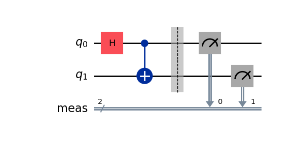
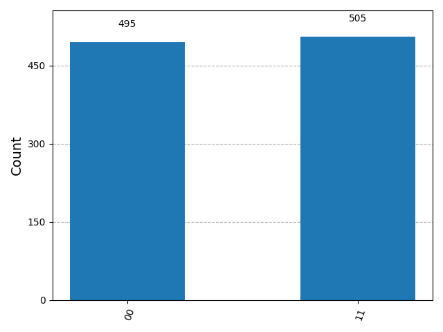

# Quantum Noise Analysis and Error Mitigation using Qiskit

## Overview

This project investigates the effects of quantum noise on quantum circuits and evaluates error mitigation techniques using Qiskit. The objective is to understand how noise degrades quantum information and to analyze methods that improve computational accuracy without full quantum error correction.

The project combines quantum computing theory, simulation, noise modeling, fidelity analysis, and experimental evaluation, following a research-oriented approach.

---

## Research Objectives

* Study common quantum noise channels
* Analyze the impact of noise on entangled quantum states
* Measure fidelity degradation under noisy conditions
* Implement and evaluate error mitigation techniques
* Compare ideal, noisy, and mitigated quantum computations
* Develop a reproducible framework for quantum noise experiments

---

## Technologies Used

* Python
* Qiskit
* Qiskit Aer
* NumPy
* Matplotlib
* Jupyter Notebook

---

## Project Structure

```text
Quantum-Noise-Analysis/
│
├── docs/
│   └── observations.md
│
├── notebooks/
│   └── 01_bell_state.ipynb
│
├── results/
│   ├── bell_circuit.png
│   └── bell_histogram.png
│
├── src/
│
├── README.md
└── .gitignore
```

---

# Experiments

## Experiment 01: Bell State Generation and Analysis

### Objective

Generate a Bell State using Qiskit and establish an ideal baseline for future noise analysis experiments.

### Theoretical Bell State

The Bell State generated in this experiment is:

[
\frac{|00\rangle + |11\rangle}{\sqrt{2}}
]

This state represents maximal two-qubit entanglement.

### Bell State Circuit



### Measurement Histogram



### Observations

* Only the states 00 and 11 were observed.
* Both outcomes appeared with approximately equal probability.
* No occurrences of 01 or 10 were detected.
* The results confirm successful Bell State generation and entanglement.

### Significance

This experiment establishes the ideal reference state against which noisy and error-mitigated circuits will be compared throughout the project.

---

## Planned Experiments

### Experiment 02

Depolarizing Noise Analysis

### Experiment 03

Bit-Flip Noise Analysis

### Experiment 04

Phase-Flip Noise Analysis

### Experiment 05

Amplitude Damping Noise Analysis

### Experiment 06

Quantum State Fidelity Evaluation

### Experiment 07

Measurement Error Mitigation

### Experiment 08

Zero Noise Extrapolation

### Experiment 09

Comparative Noise Study

### Experiment 10

Error Mitigation Performance Evaluation

---

## Current Progress

* [x] Project Setup
* [x] Bell State Generation
* [x] Ideal Quantum Simulation
* [x] Measurement Analysis
* [x] Result Visualization
* [ ] Depolarizing Noise Analysis
* [ ] Fidelity Analysis
* [ ] Error Mitigation
* [ ] Comparative Evaluation
* [ ] Final Research Report

---

## Future Work

* Execute experiments on realistic quantum noise models
* Benchmark multiple mitigation techniques
* Compare simulator results with hardware-inspired backends
* Investigate scalability with larger quantum systems
* Extend analysis toward quantum error correction methods

---

## References

* Qiskit Documentation
* IBM Quantum Learning Resources
* Nielsen & Chuang — Quantum Computation and Quantum Information

---

## Author

**Fayas Muhammed**

Research Project: Quantum Noise Analysis and Error Mitigation using Qiskit
