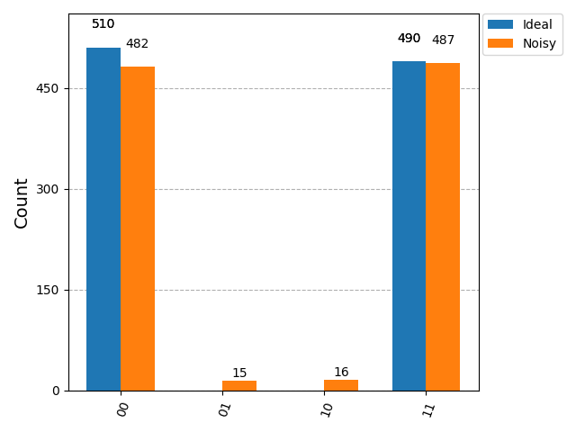
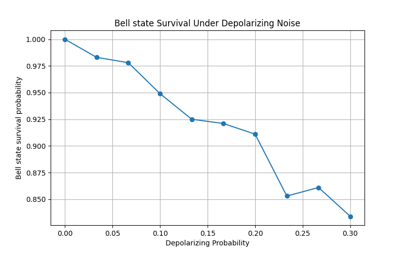
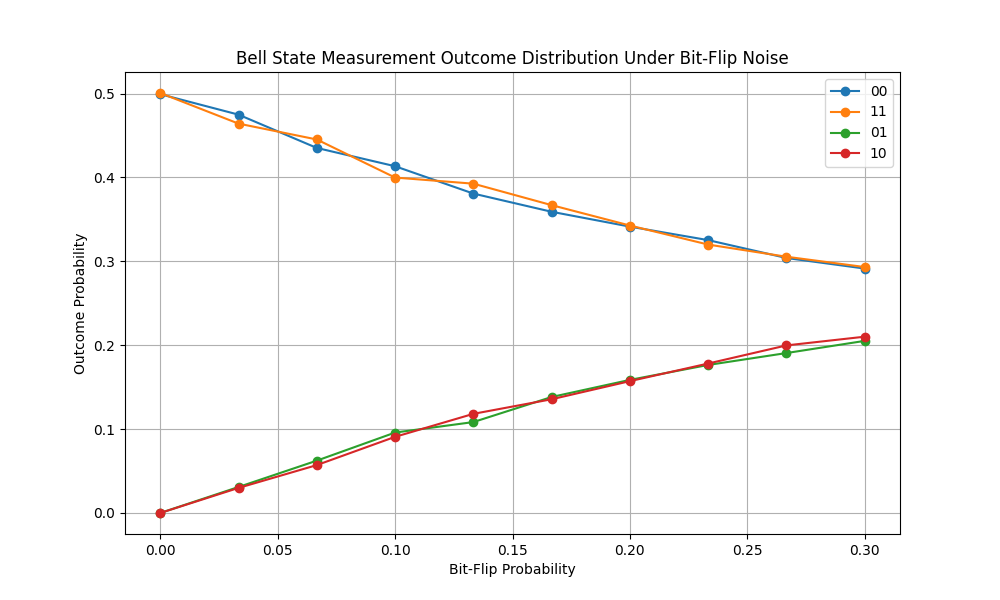
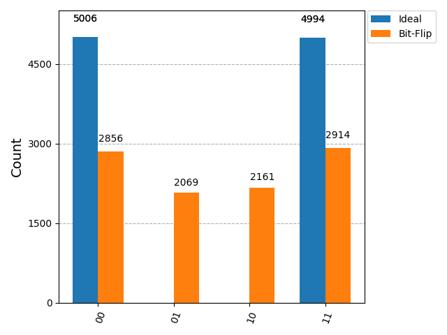

# Quantum Noise Analysis and Error Mitigation using Qiskit

## Overview

This project investigates the effects of quantum noise on quantum circuits and evaluates error mitigation techniques using Qiskit. The objective is to understand how noise degrades quantum information and to analyze methods that improve computational accuracy without full quantum error correction.

The project combines quantum computing theory, simulation, noise modeling, fidelity analysis, and experimental evaluation, following a research-oriented approach.

---

## Research Objectives

* Study common quantum noise channels
* Analyze the impact of noise on entangled quantum states
* Measure fidelity degradation under noisy conditions
* Implement and evaluate error mitigation techniques
* Compare ideal, noisy, and mitigated quantum computations
* Develop a reproducible framework for quantum noise experiments

---

## Technologies Used

* Python
* Qiskit
* Qiskit Aer
* NumPy
* Matplotlib
* Jupyter Notebook

---
## Project Structure

```text
Quantum-Noise-Analysis/
│
├── docs/
│   ├── experiment_01_bell_state.md
│   ├── experiment_02_depolarizing_noise.md
│   └── experiment_03_bit_flip_noise.md
│
├── notebooks/
│   ├── 01_bell_state.ipynb
│   ├── 02_depolarizing_noise.ipynb
│   └── 03_bit_flip_noise.ipynb
│
├── results/
│   ├── bell_circuit.png
│   ├── bell_histogram.png
│   ├── depolarizing_noise_histogram.png
│   ├── depolarizing_noise_fidelity.png
│   ├── bit_flip_histogram.png
│   └── bit_flip_probability_distribution.png
│
├── src/
│   ├── __init__.py
│   ├── circuits.py
│   ├── noise_models.py
│   └── visualization.py
│
├── README.md
├── .gitignore
└── test_imports.py
```

---

# Experiments

## Experiment 01: Bell State Generation and Analysis

### Objective

Generate a Bell State using Qiskit and establish an ideal baseline for future quantum noise analysis and error mitigation experiments.

### Theoretical Bell State

The Bell State generated in this experiment is:

```text
(|00⟩ + |11⟩)/√2
```

This state is a maximally entangled two-qubit quantum state, where the measurement outcomes of both qubits are perfectly correlated.

### Bell State Circuit


### Measurement Histogram


### Observations

* Only the states **00** and **11** were observed.
* Both outcomes appeared with approximately equal probability.
* No occurrences of **01** or **10** were detected.
* The results confirm successful Bell State generation and quantum entanglement.
* The measurement statistics closely match theoretical expectations for an ideal Bell State.

### Significance

This experiment establishes the ideal reference state against which noisy and error-mitigated circuits will be compared throughout the project. It serves as the baseline for evaluating the effects of quantum noise on entangled states in subsequent experiments.

---

---

## Experiment 02: Depolarizing Noise Analysis

### Results





### Key Observation

Bell State survival probability decreases as depolarizing noise strength increases, demonstrating degradation of quantum information under realistic noise conditions.

## Experiment 03: Bit-Flip Noise Analysis

### Objective

Investigate the effect of bit-flip errors on an entangled Bell State and analyze how increasing error probability alters measurement outcomes.

### Background

Bit-flip noise is one of the fundamental quantum error models and is analogous to a classical bit error. A bit-flip error changes a qubit state according to:

```text
|0⟩ → |1⟩
|1⟩ → |0⟩
```

Unlike depolarizing noise, which introduces random disturbances, bit-flip noise produces structured and predictable error patterns.

### Measurement Outcome Distribution



### Histogram Comparison



### Key Results

* The ideal Bell State produced only the outcomes **00** and **11**.
* Increasing bit-flip probability reduced the occurrence of the correct Bell State outcomes.
* Error states **01** and **10** appeared with increasing probability.
* The resulting error patterns were structured and consistent with theoretical predictions.

### Significance

This experiment demonstrates how specific quantum error channels affect entangled quantum states and provides motivation for quantum error correction techniques designed to detect and correct bit-flip errors.
---

## Planned Experiments

### Experiment 04

Phase-Flip Noise Analysis

### Experiment 05

Amplitude Damping Noise Analysis

### Experiment 06

Quantum State Fidelity Evaluation

### Experiment 07

Measurement Error Mitigation

### Experiment 08

Zero Noise Extrapolation

### Experiment 09

Comparative Noise Study

### Experiment 10

Error Mitigation Performance Evaluation

---
## Current Progress

* [x] Project Setup
* [x] Bell State Generation
* [x] Ideal Quantum Simulation
* [x] Depolarizing Noise Analysis
* [x] Bit-Flip Noise Analysis
* [x] Result Visualization
* [ ] Phase-Flip Noise Analysis
* [ ] Amplitude Damping Analysis
* [ ] Fidelity Analysis
* [ ] Error Mitigation
* [ ] Final Research Report


---

## Future Work

* Execute experiments on realistic quantum noise models
* Benchmark multiple mitigation techniques
* Compare simulator results with hardware-inspired backends
* Investigate scalability with larger quantum systems
* Extend analysis toward quantum error correction methods

---

## References

* Qiskit Documentation
* IBM Quantum Learning Resources
* Nielsen & Chuang — Quantum Computation and Quantum Information

---

## Author

**Fayas Muhammed**

Research Project: Quantum Noise Analysis and Error Mitigation using Qiskit
